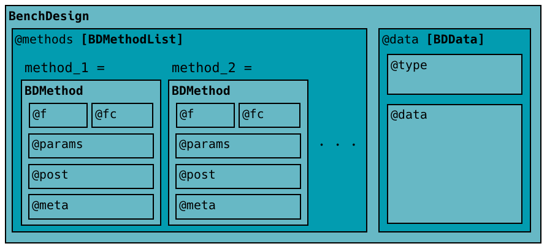

```{r echo=FALSE, include=FALSE}
knitr::opts_chunk$set(tidy = FALSE, cache = TRUE, dev = "png",
                      message = FALSE, error = FALSE, warning = TRUE)
```

# Introduction

This vignette assumes that the user is familiar with the basics of the `SummarizedBenchmark` framework for benchmarking computational methods described in the **SummarizedBenchmark: Introduction** vignette (the "introduction"). New users should start from the package description and example presented in the introduction before moving on to more advanced topics, including the class descriptions in this vignette. Here, we describe the anatomy of the *BenchDesign* and *SummarizedBenchmark* classes in a little more detail than was presented in the introduction. 

## Example Case Study

```{r load-packages}
library("SummarizedBenchmark")
library("magrittr")
```

The classes are described in more detail using the same example benchmark of methods for multiple comparisons adjustment described in the introduction. Briefly, three methods, the Bonferroni correction, Benjamini-Hochberg step-up procedure, and Storey's FDR q-value were benchmarked on a collection of 50 simulated two-sample t-tests. The simulated t-test results which serve as inputs to the methods are included with the package in the `tdat` data set.

```{r run-case-study}
data(tdat)

b <- BenchDesign(data = tdat) %>%
    addMethod(label = "bonf", func = p.adjust,
              params = rlang::quos(p = pval, method = "bonferroni")) %>%
    addMethod(label = "BH",
              func = p.adjust,
              params = rlang::quos(p = pval, method = "BH")) %>%
    addMethod(label = "qv",
              func = qvalue::qvalue,
              params = rlang::quos(p = pval),
              post = function(x) { x$qvalues })

sb <- buildBench(b, truthCols = "H")
```

The code above is identical to what was used in the introduction to construct the *BenchDesign*, `b`, and the *SummarizedBenchmark* results, `sb`. If any of this is unclear, consider revisting the **SummarizedBenchmark: Introduction** vignette.

# BenchDesign

*BenchDesign* objects are composed of a data set and methods. Formally, the methods are stored in the *BenchDesign* as a *BDMethodList* and the data as a *BDData* object. As would be expected, the *BDMethodList* is a list (`List`) of *BDMethod* objects, each containing the definition of a method to be compared in the benchmark experiment. The general structure is illustrated in the figure below. 



Continuing with the *BenchDesign* constructed above, we can access the list of methods and the data set stored in the object using the `BDMethodList()` and `BDData()` functions.

```{r}
BDMethodList(b)
BDData(b)
```

## BDMethod and BDMethodList

The list of methods inherits from the *SimpleList* class, and supports several useful accessor and setter features.

```{r}
BDMethodList(b)[["bonf"]]
```

This interface allows for adding new methods by creating a new named entry in the *BDMethodList* of the *BenchDesign* object.

```{r}
BDMethodList(b)[["bonf2"]] <- BDMethodList(b)[["bonf"]]
b
```

Methods can also be removed by setting the list value to NULL. An equivalent convenience function, `dropMethod()` also exists for removing methods using syntax similar to `addMethod()`.

```{r}
BDMethodList(b)[["bonf"]] <- NULL
b
```

Each *BDMethod* object in a *BDMethodList* encapsulates a method to be benchmarked. The contents of the object are all of the arguments passed through the `addMethod()` convenience function used in the example above. New *BDMethod* objects can be constructed directly using the `BDMethod()` constructor, which takes the same input parameters as `addMethod()`. 

```{r}
bdm_bonf <- BDMethod(x = p.adjust, 
                     params = rlang::quos(p = pval, 
                                          method = "bonferroni"))
bdm_bonf
```

Directly modifying the *BDMethodList* object provides an alternative approach (aside form using `addMethod()`) to adding methods to a *BenchDesign* object.

```{r}
BDMethodList(b)[["bonf"]] <- bdm_bonf
b
```

## BDData

The *BDData* object is a simple object which only contains two slots, `@type` and `@data`. The `@type` of a *BDData* object can be either `data` or `hash`. If the `@type` is `data`, the `@data` slot is a standard list or data.frame object of raw data. However, if the `@type` is `hash`, then the `@data` slot is just a MD5 hash of some raw data object computed using `digest::digest()`. As described next in Section \@ref(summarizedbenchmark), *SummarizedBenchmark* objects also contain the *BenchDesign* object used to generate the benchmark results. Often, the original raw data can be large, and saving the full data set as part of the *SummarizedBenchmark* object can be undesirable and unnecessary. While the raw data set is needed during the benchmark experiment, by default, the *BDData* is converted to a MD5 hash beforing stored the *BenchDesign* as part of a *SummarizedBenchmark* object. Using this approach, it is still possible to confirm whether a certain data set was used for a benchmarking experiment without having to store copies of the raw data with every *SummarizedBenchmark*.  

Returning to the *BenchDesign* example from above, the *BDData* object of a *BenchDesign* can also be similarly extracted and modified. As with *BDMethod* objects, the data set may be removed by setting the value to NULL.

```{r}
BDData(b) <- NULL
b
```

A new data set can be constructed using the `BDData()` function and used to replace the data set in a *BenchDesign* object.

```{r}
bdd <- BDData(data = tdat)
BDData(b) <- bdd
b
```

The helper function `hashBDData()` can be called on either *BDData* or *BenchDesign* objects to convert the data to a MD5 hash. By default, this function is called on the *BenchDesign* object during `buildBench()` before storing the object in the resulting *SummarizedBenchmark*.

```{r}
b <- hashBDData(b)
b
```

We drop the `"bonf2"` method from the object to return to the same set of methods used to generate the *SummarizedBenchmark* object.

```{r}
BDMethodList(b)[["bonf2"]] <- NULL
```

# SummarizedBenchmark

As described above, the *SummarizedBenchmark* class builds on the existing *SummarizedExperiment* class and Bioconductor infrastructure. By doing so, saved results are tightly linked to metadata. Thus, it is possible, for example, to easily subset the results without losing references to the respective metadata. For example, the code below extracts the data for only the first two methods.
 
```{r}
sbSub <- sb[, 1:2]
colData(sbSub)
```

Building on the *SummarizedExperiment* class, in addition to the slot for `performanceMetrics` described above, the *SummarizedBenchmark* class also includes a slot which stores a copy of the *BenchDesign* object used to generate the results with `buildBench()`. The *BenchDesign* can be accessed by simply passing the object to `BenchDesign()`. 

```{r}
BenchDesign(sb)
```

Notice, however, unlike the original *BenchDesign* above, the data is stored as a MD5 hash. To prevent bloat when the data set is large, by default, only a MD5 hash computed using `digest::digest()` is stored with the benchmarking results. This behavior can be changed by setting `keepData = TRUE` when calling `buildBench()`, in which case, the complete data set will be stored as part of the *BenchDesign* and *SummarizedBenchmark* objects. A simple helper function, `compareBDData()`, can be used to verify that while the data *type* may be different between the data originally used to construct the *SummarizedBenchmark* and the data stored with the *SummarizedBenchmark*, the referenced data sets are the same (i.e. have matching MD5 hash values). 

```{r}
compareBDData(BDData(tdat), BenchDesign(sb))
```

Finally, information about the R session where the methods were executed is stored in the metadata of the *SummarizedBenchmark* as an entry in a list called `sessions`. The package supports rerunning benchmark experiments, and for this purpose, each new session is stored as a new entry in the `sessions` list. Since this experiment has only been executed once, the list only has a single entry in the `sessions` list. In addition to storing the session info and list of methods evaluated during the session, the list also keeps track of all parameters in the `buildBench()` call, i.e. `truthCols = "H"`.

```{r}
metadata(sb)$sessions[[1]]
```

# Reproducibility and Replicability

While the *BenchDesign* and *SummarizedBenchmark* classes are designed to enable easier reproduction and replication of benchmark experiments, they are not meant to completely replace properly written and documented analyses. If any functions or packages are needed for the methods defined in the *BenchDesign*, they must be available and sourced or loaded when running (or re-running) the analyses. As an example, suppose we have the following locally defined method, `mymethod()`, which depends on another locally defined, but unavailable, function, `mysubmethod()`. 

```{r}
mymethod <- function(x) {
    mysubmethod(x)
}
mybd <- BenchDesign(data = list(vals = 1:5))
mybd <- addMethod(mybd, "method1", mymethod,
                  params = rlang::quos(x = vals))
```

The top level `mymethod()` is captured in the corresponding *BDMethod* and *BenchDesign*. No errors are thrown since including `mymethod()` in a *BenchDesign* object does not require evaluating the function. 

```{r}
BDMethod(mybd, "method1")@f
```

However, when `buildBench()` is called, the method naturally fails because the necessary `mysubmethod()` is not available in the current session.

```{r, message = TRUE}
tryCatch({ buildBench(mybd) }, error = function(e) print(e))
```

Therefore, if any locally defined functions are necessary for a method, they should be available along with the *BenchDesign* object or defined at the top level. Additionally, for reproducibility and clarity, we generally recommend keeping functions as "self-contained" as possible, and *never* relying on variables defined externally, e.g. in the global enviroment. Scoping with functions can be confusing, and it may not always be clear where constants are being evaluated. As an example, consider the following simple multiplying function.

```{r}
m <- 5
mymult <- function(x) {
    m * x
}
m <- 2

mybd <- BenchDesign(data = list(vals = 1:5, m = 10))
mybd <- addMethod(mybd, "methodr", mymult,
                  params = rlang::quos(x = vals))
```

While experienced R programmers may know which value of `m` (5, 2 or 10) will be used when `buildBench()` is called, for many users, this is less obvious.

```{r}
assay(buildBench(mybd))
```

The answer is the value assigned most recently in the environment where `mymult()` was defined, `R_GlobalEnv`, the global environment (`m = 2`). Note, however, that if the *BenchDesign* is saved and reloaded in a new session, whatever value of `m` is defined in the global environment of the new session will be used. If `m` is not defined in the new session, an error will be thrown. In this case, `m` should either be explicitly defined within the function or passed as a second input variable of `mymult()` and defined with `params =` in the *BDMethod*.

While it may be possible to aggressively capture all code and environment variables defined with each method in a *BenchDesign*, it is not within the scope of this package, and furthermore, may not be the best appraoch to constructing a reproducible benchmark. While redundant, for emphasis, we reiterate that the `SummarizedBenchmark` framework is a solution for structuring benchmark experiments which complements, but does not replace, well documented and organized code.

# BenchDesign Features

Several less prominent, but hopefully useful features are also implemented for working with objects of the *BenchDesign*, *BDMethod*, and *BDMethodList* classes.

## Specifying Method Metadata

As seen in the example above, metadata for methods are stored in the `colData()` of *SummarizedBenchmark* objects. Several default metadata columns are populated in the `colData()` of the *SummarizedBenchmark* object generated by a call to `buildBench()`. However, sometimes it may be useful to include additional metadata columns beyond just the defaults. While this can be accomplished manually by modifying the `colData()` of the *SummarizedBenchmark* object post hoc, method metadata can also be specified at the `addMethod()` step using the `meta =` optional parameter. The `meta =` parameter accepts a **named list** of metadata information. Each list entry will be added to the `colData()` as a new column, and should be the same type across methods to prevent possible errors. To avoid collisions between metadata columns specified with `meta =` and the default set of columns, metadata specified using `meta =` will be added to `colData()` with `meta.` prefixed to the column name.  

As an example, we construct a *BenchDesign* object again using the multiple hypothesis testing example. The *BenchDesign* is created with two methods, Bonferroni correction and the Benjamini-Hochberg step-up procedure. Each method is specified with the optional `meta =` parameter noting the type of control provided, either familywise error rate (FWER) or false discovery rate (FDR). We can verify that the manually defined metadata column (`meta.type`) is available in the `colData()` of the newly generated *SummarizedBenchmark*.

```{r}
b_withmeta <- BenchDesign(data = tdat) %>%
    addMethod(label = "bonf", func = p.adjust,
              meta = list(type = "FWER control"),
              params = rlang::quos(p = pval, method = "bonferroni")) %>%
    addMethod(label = "BH",
              func = p.adjust,
              meta = list(type = "FDR control"),
              params = rlang::quos(p = pval, method = "BH"))

sb_withmeta <- buildBench(b_withmeta)
colData(sb_withmeta)
```

While all methods in this example had the `meta =` option specified, this is not necessary. It is completely acceptable to specify the `meta =` parameter for only a subset of methods. Missing entries will be recorded as `NA`s in the `colData()`.

## Specifying Version Metadata

Arguably, two of the most important pieces of metadata stored in the `colData()` of the *SummarizedBenchmark* returned by `buildBench()` are the relevant package name and version (`pkg_name`, `pkg_vers`). Determining the package name and version requires the primary "workhorse" function of the method be directly specified as `func =` in the `addMethod()` call. In some cases, this may not be possible, e.g. if the "workhorse" function is a wrapper. However, there still might exist an important function for which we would like to track the package name and version. The `meta` parameter can help.  

The `meta =` parameter will handle the following named list entries as special values: `pkg_name`, `pkg_vers`, `pkg_func`. First, if values are specified for `pkg_name` and `pkg_vers` in `meta =`, these will overwrite the values determined from `func =`. To trace the source of `pkg_name` and `pkg_vers` information, the `func.pkg.manual` column of the `colData` will be set to `TRUE` (the default value is `FALSE`). Alternatively, a function can be passed to `meta =` as `pkg_func`. This function will be used to determine both `pkg_name` and `pkg_vers`, and will take precendence over manually specified `pkg_name` and `pkg_vers` values. If `pkg_func` is specified, it will be included in the `colData()` as a new column with the same name, and the `vers_src` column will be set to `"meta_func"`. **Note: the function should be wrapped in `rlang::quo` to be properly parsed.  

We illustrate the behavior when using either `pkg_func` or `pkg_name` and `pkg_vers` with the `meta` optional parameter using the same multiple testing example from above. First, notice that Storey's q-value method was previously included in the *BenchDesign* with a `post =` argument to extract q-values from the result of calling `qvalue::qvalue` on the data.

```{r}
printMethod(b, "qv")
```

We can avoid specifying `post =` by using the following wrapper function in place of the direct call to `qvalue::qvalue`.

```{r}
qv_wrapper <- function(...) {
    qvalue::qvalue(...)$qvalues
}

b_qv <- BenchDesign(data = tdat) %>%
    addMethod(label = "qv",
              func = qvalue::qvalue,
              params = rlang::quos(p = pval),
              post = function(x) { x$qvalues }) %>%
    addMethod(label = "qv_wrapper",
              func = qv_wrapper,
              params = rlang::quos(p = pval))
```

However, we see that while the results for the two methods are the same, the `colData()` of the resulting *SummarizedBenchmark* object is missing the valuable package name and version information for the wrapper-based approach.

```{r}
sb_qv <- buildBench(b_qv)
head(assay(sb_qv))
colData(sb_qv)
```

This can be fixed by specifying either the `pkg_func` or `pkg_name` and `pkg_vers` metadata values.

```{r}
b_qv <- b_qv %>%
    addMethod(label = "qv_pkgfunc",
              func = qv_wrapper,
              meta = list(pkg_func = qvalue::qvalue),
              params = rlang::quos(p = pval)) %>%
    addMethod(label = "qv_pkgname",
              func = qv_wrapper,
              meta = list(pkg_name = "qvalue", pkg_vers = as.character(packageVersion("qvalue"))),
              params = rlang::quos(p = pval))

sb_qv <- buildBench(b_qv)
colData(sb_qv)
```

The `func.pkg` and `func.pkg.vers` columns of the `colData()` are now populated with the correct information, and furthermore, the `func.pkg.manual` column is set to `TRUE` for the two latter methods.  

## Modifying Methods in a BenchDesign

Modifying the defintion of a method after it has been added to a *BenchDesign* is supported by the `modifyMethod()` function. The *BenchDesign* object created in the multiple testing example above, `b`, includes a method called `qv`.

```{r}
printMethod(b, "qv")
```

Suppose we wish to specify an additional `pi0 =` parameter for the `qvalue::qvalue` method as well as add a new metadata tag. This can be accomplished by passing both new parameters to the `params =` parameter of `modifyMethod()` as a `rlang::quos(..)` list. By default, all entries in the `rlang::quos(..)` list are assumed to be parameters for the main function of the method. However, `func`, `post`, or `meta` values can also be modified by included in their new values in the list using the special keywords, `bd.func =`, `bd.post =`, or `bd.meta =`. In the example below, we both add a new parameter , `pi0 =` and modify the `meta =` specification.

```{r}
new_params <- rlang::quos(pi0 = 0.9, bd.meta = list(type = "FDR control"))
b_modqv <- modifyMethod(b, label = "qv", params = new_params)

printMethod(b_modqv, "qv")
```

We can see that the original method parameters, namely `p = pval`, is still defined for method, while the new method parameter `pi0 = 0.9` has been added along with the new metadata specification. However, sometimes it may be desirable to completely overwrite all function parameters for a method, e.g. if we decide to completely redefine the parameters of a method. This may occur if some parameters were optional and originally specified, but no longer necessary. All function parameters can be overwritten by specifying `.overwrite = TRUE`.

```{r}
b_modqv <- modifyMethod(b, label = "qv", params = new_params, .overwrite = TRUE)

printMethod(b_modqv, "qv")
```

Now the originally specified `p = pval` is no longer included in the method definition. Obviously, this is not reasonable in this setting as the `p` parameter is a necessary parameter to run the method. Note that specifications of `bd.meta =` will always overwrite the existing metadata values of the method, even when `.overwrite = FALSE`.

## Duplicating Methods in a BenchDesign

In addition to comparing multiple methods, a benchmark study may also involve comparing a single method across several parameter settings. The `expandMethod()` function provides the capability to take a method already defined in the *BenchDesign*, and _expand_ it to multiple methods with differing parameter values in the *BenchDesign* object. In the following example, `expandMethod()` is used to duplicate the `qv` method with only the `pi0` parameter modified. By default, the expanded method, in this case `qv`, is dropped. To prevent this from happening, `.replace = FALSE` can be specified.

Expanding the `qv` method with `expandMethod()` is accomplished by specifying any new parameters of the variant methods to `params =` as a `rlang::quos(..)` list. Here, two new variants of the `qv` method, `qv-p90` and `qv-p10`, are created with new values of the `pi0` parameter.

```{r}
b_expand <- expandMethod(b, label = "qv", 
                         params = list(qv_p90 = rlang::quos(pi0 = 0.90),
                                       qv_p10 = rlang::quos(pi0 = 0.10)),
                         .replace = FALSE)

b_expand
printMethod(b_expand, "qv_p90")
printMethod(b_expand, "qv_p10")
```

When only a single parameter is modifed as in the example above, an alternative shorthand is provided. The parameter can be specified with `onlyone =` and the corresponding values specified with the new method names to `params =`.

```{r}
b_expand <- expandMethod(b, label = "qv", onlyone = "pi0",
                         params = rlang::quos(qv_p90 = 0.90,
                                              qv_p10 = 0.10),
                         .replace = FALSE)

b_expand
```

The resulting modified *BenchDesign* object is the same.

# SummarizedBenchmark Features

Aside from the standard *SummarizedBenchmark* 

## Manually Constructing

Throughout our documentation, *SummarizedBenchmark* objects are constructed exclusively using our recommended workflow by running `buildBench()` with a *BenchDesign* object. This recommended approach enables users to perform benchmark comparisons while automatically keeping track of parameters and software metadata. However, it is also possible to skip this recommended approach and construct a *SummarizedBenchmark* object directly from standard `S3` data objects.

Using data from the `r BiocStyle::Biocpkg("iCOBRA")`package [@Soneson_2016], this part of the vignette demonstrates how to build *SummarizedBenchmark* objects from `S3` objects. The dataset contains differential expression results of three different methods (`r BiocStyle::Biocpkg("limma")`, `r BiocStyle::Biocpkg("edgeR")` and `r BiocStyle::Biocpkg("DESeq2")`) applied to a simulated RNA-seq dataset.

```{r cobraData, message=FALSE, warning=FALSE}
library(iCOBRA)
data(cobradata_example)
```

The process of building a *SummarizedBenchmark* object is similar to the process of constructing a *SummarizedExperiment* object. To build a *SummarizedBenchmark* object, three main objects are required: (1) a list where each element corresponds to a *data.frame*, (2) a *DataFrame* with annotations of the methods, and (3) when available, a *DataFrame* of ground truths. 

In the *SummarizedBenchmark* object, each output of the methods is considered a different `assay`. For example, using the differential expression dataset example, we can define two assays, q-values and estimated log fold changes. For each `assay`, we arrange the output of the different methods as a matrix where each column corresponds to a method and each row corresponds to each feature (in this case, genes). We will need a list in which each of it's element corresponds to an assay.

```{r arrangeLists}
assays <- list(qvalue = cobradata_example@padj,
               logFC = cobradata_example@score)
assays[["qvalue"]]$DESeq2 <- p.adjust(cobradata_example@pval$DESeq2, method = "BH")

head(assays[["qvalue"]], 3)
head(assays[["logFC"]], 3)
```

Since these are simulated data, the ground truths for both assays are known and available. We can format these as a *DataFrame* where each column corresponds to an assay and each row corresponds to a feature.

```{r groundTruths}
library(S4Vectors)

groundTruth <- DataFrame(cobradata_example@truth[, c("status", "logFC")])
colnames(groundTruth) <- names(assays)
groundTruth <- groundTruth[rownames(assays[[1]]), ]

head(groundTruth)
```

Finally, the method names are also reformatted as a *DataFrame* of simple annotation data of the methods.

```{r buildColData}
colData <- DataFrame(method = colnames(assays[[1]]))
colData
```

A *SummarizedBenchmark* is built using the following call to the `SummarizedBenchmark()` constructor.

```{r buildSB}
sb <- SummarizedBenchmark(assays = assays, colData = colData, groundTruth = groundTruth)
```

# Next Steps 

This vignette described the structure of the *BenchDesign* and *SummarizedBenchmark* classes which underly the `SummarizedBenchmark` package, as well as several complex and non-standard features of both classes. Examples of using these classes and the `SummarizedBenchmark` framework can be found in the **SummarizedBenchmark: Full Case Study** vignette as well as in the other **Case Study** vignettes. More advanced features are also described in various **Feature** vignettes.

# References

