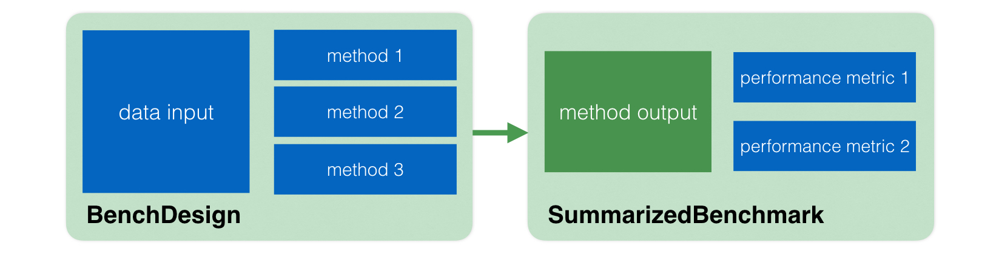

```{r echo=FALSE, include=FALSE}
knitr::opts_chunk$set(tidy = FALSE,
                      cache = TRUE,
                      dev = "png",
                      message = FALSE,
                      error = FALSE,
                      warning = TRUE)
```

# Introduction

With `SummarizedBenchmark`, a complete benchmarking workflow is comprised of three primary components:

1. data,
2. methods, and
3. performance metrics.

The first two (_data_ and _methods_) are necessary for carrying out the benchmark experiment, and the last (_performance metrics_) is essential for evaluating the results of the experiment. Following this approach, the `SummarizedBenchmark` package defines two primary types of objects: *BenchDesign* objects and *SummarizedBenchmark* objects. *BenchDesign* objects contain only the design of the benchmark experiment, namely the _data_ and _methods_, where a _method_ is defined as the combination of a function or algorithm and parameter settings. After constructing a *BenchDesign*, the experiment is executed to create a *SummarizedBenchmark* containing the results of applying the methods to the data. *SummarizedBenchmark* objects extend the Bioconductor `SummarizedExperiment` class, with the additional capability of working with _performance metrics_.  

The basic framework is illustrated in the figure below. A *BenchDesign* is created with _methods_ and combined with _data_ to create a *SummarizedBenchmark*, which contains the output of applying the methods to the data. This output is then paired with _performance metrics_ specified by the user. Note that the same *BenchDesign* can be combined with several data sets to produce several *SummarizedBenchmark* objects with the corresponding outputs. For convenience, several default _performance metrics_ are implemented in the package, and can be added to *SummarizedBenchmark* objects using simple commands.  



In this vignette, we first illustrate the basic use of both the *BenchDesign* and *SummarizedBenchmark* classes with a simple comparison of methods for p-value correction in the context of multiple hypothesis testing. Then, we describe more advanced features of the package with a case study comparing three methods for differential expression analysis.

## Related Work

Other frameworks for benchmarking methods in R, include `r BiocStyle::Biocpkg("iCOBRA")` (a package for comparing results of _"binary classification and ranking methods"_ with a Shiny web application for interactive analyses) and `r BiocStyle::Githubpkg("stephenslab/dsc")` (a framework for _"managing computational benchmarking experiments that compare several competing methods"_ written in Python but capable of running methods implemented in both Python and R).

# Quickstart Case Study

```{r}
library("SummarizedBenchmark")
library("magrittr")
```

To illustrate the basic use of the *BenchDesign* class, we use the `tdat` data set included with this package. 

```{r}
data(tdat)
```

The data set is a *data.frame* containing the results of 50 two-sample t-tests. The tests were performed using independently simulated sets of 20 observations drawn from a single standard Normal distribution (when `H = 0`) or two mean-shifted Normal distributions (when `H = 1`).

```{r}
head(tdat)
```

Several approaches have been proposed and implemented to compute *adjusted p-values* and *q-values* with the goal of controlling the total number of false discoveries across a collection of tests. In this example, we compare three such methods:

1. Bonferroni correction (`p.adjust` w/ `method = "bonferroni"`) [@Dunn_1961],
2. Benjamini-Hochberg (`p.adjust` w/ `method = "BH"`) [@Benjamini_1995], and
3. Storey's FDR q-value (`qvalue::qvalue`) [@Storey_2002].

First, consider how benchmarking the three methods might look without the *SummarizedBenchmark* framework.  

To compare methods, each is applied to `tdat`, and the results are stored in separate variables. 

```{r}
adj_bonf <- p.adjust(p = tdat$pval, method = "bonferroni")

adj_bh <- p.adjust(p = tdat$pval, method = "BH")

qv <- qvalue::qvalue(p = tdat$pval)
adj_qv <- qv$qvalues
```

Since the values of interest are available from the ouput of each method as a vector of length 50 (the number of hypotheses tested), to keep things clean, they can be combined into a single *data.frame*.

```{r}
adj <- cbind.data.frame(adj_bonf, adj_bh, adj_qv)
head(adj)
```

The *data.frame* of adjusted p-values and q-values can be used to compare the methods, either by directly parsing the table or using a framework like `r BiocStyle::Biocpkg("iCOBRA")`. Additionally, the *data.frame* can be saved as a `RDS` or `Rdata` object for future reference, eliminating the need for recomputing on the original data.  

While this approach can work well for smaller comparisons, it can quickly become overwhelming and unweildy as the number of methods and parameters increases. Furthermore, once each method is applied and the final *data.frame* (`adj`) is constructed, there is no way to determine *how* each value was calculated. While an informative name can be used to "label" each method (as done above), this does not capture the full complexity, e.g. parameters and context, where the function was evaluated. One solution might involve manually recording function calls and parameters in a separate *data.frame* with the hope of maintaining synchrony with the output *data.frame*. However, this is prone to errors, e.g. during fast "copy and paste" operations or additions and deletions of parameter combinations. An alternative (and hopefully better) solution, is to use the framework of the *SummarizedBenchmark* package.

In the *SummarizedBenchmark* approach, a *BenchDesign* is constructed with the data and any number of methods. Optionally, a *BenchDesign* can also be constructed without any data or method inputs. Methods and data can be added or removed from the object modularly in a few different ways, as will be described in the following section. For simplicity, we first show how to construct the *BenchDesign* with just the data set as input. The data object, here `tdat`, must be passed explicitly to the `data =` parameter.

```{r}
b <- BenchDesign(data = tdat)
```

Then, each method of interest can be added to the *BenchDesign* using `addMethod()`.

```{r}
b <- addMethod(bd = b, label = "bonf", func = p.adjust,
               params = rlang::quos(p = pval, method = "bonferroni"))
```

At a minimum, `addMethod()` requires three parameters:

1. `bd`: the *BenchDesign* object to modify,
2. `label`: a character name for the method, and
3. `func`: the function to be called.

After the minimum parameters are specified, any parameters needed by the `func` method should be passed as named parameters, e.g. `p = pval, method = "bonferroni"`, to `params =` as a list of [*quosures*](http://rlang.tidyverse.org/reference/quosure.html) using `rlang::quos(..)`. Notice here that the `pval` wrapped in `rlang::quos(..)` **does not** need to be specified as `tdat$pval` for the function to access the column in the data.frame. For readers familiar with the `r BiocStyle::CRANpkg("ggplot2")` package, the use of `params = rlang::quos(..)` here should be viewed similar to the use of `aes = aes(..)` in `ggplot2` for mapping between the data and plotting (or benchmarking) parameters.  

The process of adding methods can be written more concisely using the pipe operators from the `r BiocStyle::CRANpkg("magrittr")` package.

```{r}
b <- b %>% 
    addMethod(label = "BH",
              func = p.adjust,
              params = rlang::quos(p = pval, method = "BH")) %>%
    addMethod(label = "qv",
              func = qvalue::qvalue,
              params = rlang::quos(p = pval),
              post = function(x) { x$qvalues })
```

For some methods, such as the q-value approach above, it may be necessary to call a "post-processing" function on the primary method to extract the desired output (here, the q-values). This should be specified using the optional `post =` parameter. 

Now, the *BenchDesign* object contains three methods. This can be verified either by calling on the object.

```{r}
b
```

More details about each method can be seen by using the `printMethods()` function.

```{r}
printMethods(b)
```

While the bench now includes all the information necessary for performing the benchmarking study, the actual adjusted p-values and q-values have not yet been calculated. To do this, we simply call `buildBench()`. While `buildBench()` does not require any inputs other than the *BenchDesign* object, when the corresponding ground truth is known, the `truthCols =` parameter should be specified. In this example, the `H` column of the `tdat` *data.frame* contains the true null or alternative status of each simulated hypothesis test. Note that if any of the methods are defined in a separate package, they must be installed and loaded _before_ running the experiment. 

```{r}
sb <- buildBench(b, truthCols = "H")
```

The returned object is a *SummarizedBenchmark* class. The *SummarizedBenchmark* object is an extension of a *SummarizedExperiment* object. The table of adjusted p-values and q-values is contained in a single "assay" of the object with each method added using `addMethod()` as a column with the corresponding `label` as the name.

```{r}
head(assay(sb))
```

Metadata for the methods is contained in the `colData()` of the same object, with each row corresponding to one method in the comparison.

```{r}
colData(sb)
```

In addition to columns for the functions and parameters specified with `addMethod()` (`func, post, label, param.*`), the `colData()` includes several other columns added during the `buildBench()` process. Most notably,  columns for the package name and version of `func` if available (`func.pkg`, `func.pkg.vers`). 

When available, ground truth data is contained in the `rowData()` of the *SummarizedBenchmark* object.

```{r}
rowData(sb)
```

In addition, the *SummarizedBenchmark* class contains an additional slot where users can define performance metrics to evaluate the different methods. Since different benchmarking experiments may require the use of different metrics to evaluate the performance of the methods, the *SummarizedBenchmark* class provides a flexible way to define performance metrics. We can define performance metrics using the function `addPerformanceMetric()` by providing a *SummarizedBenchmark* object, a name of the metric, an assay name, and the function that defines it. Importantly, the function must contain the following two arguments: query (referring to a vector of values being evaluated, i.e. the output of one method) and truth (referring to the vector of ground truths). If further arguments are provided to the performance function, these must contain default values. 

For our example, we define the performance metric "TPR" (True Positive Rate) that calculates the fraction of true positives recovered given an alpha value. This performance metric uses the `H` assay of our *SummarizedBenchmark* example object.

```{r addPerformanceMetric}
sb <- addPerformanceMetric(
  object = sb,
  assay = "H",
  evalMetric = "TPR",
  evalFunction = function(query, truth, alpha = 0.1) {
    goodHits <- sum((query < alpha) & truth == 1)
    goodHits / sum(truth == 1)
    }
)

performanceMetrics(sb)[["H"]]
```

Having defined all the desired performance metrics, the function `estimatePerformanceMetrics()` calculates these for each method. Parameters for the performance functions can be passed here. In the case below, we specify several `alpha =` values to be used for calculating the performance metrics with each function.

```{r}
resWide <- estimatePerformanceMetrics(sb, alpha = c(0.05, 0.1, 0.2))
resWide
```

By default, the function above returns a *DataFrame*, where the parameters of the performance function are stored in its `elementMetadata()`.

```{r elWide}
elementMetadata(resWide)
```

A second possibility is to set the parameter `addColData = TRUE` for these results to be stored in the `colData()` of the *SummarizedBenchmark* object. 

```{r}
sb <- estimatePerformanceMetrics(sb, 
                                 alpha = c(0.05, 0.1, 0.2), 
                                 addColData = TRUE)
colData(sb)
elementMetadata(colData(sb))
```

Finally, if the user prefers tidier formats, by setting the parameter `tidy = TRUE` the function returns a long-formated version of the results. 

```{r}
estimatePerformanceMetrics(sb, 
                           alpha = c(0.05, 0.1, 0.2), 
                           tidy = TRUE)
```

As an alternative to get the same *data.frame* as the previous chunk, we can call the function `tidyUpMetrics()` on the saved results from a *SummarizedBenchmark* object.

```{r}
head(tidyUpMetrics(sb))
```

For example, the code below extracts the TPR for an alpha of 0.1 for the Bonferroni method.

```{r}
tidyUpMetrics(sb) %>%
  dplyr:::filter(label == "bonf", alpha == 0.1, performanceMetric == "TPR") %>%
  dplyr:::select(value)
```

# Class Details

Before moving to the second case study, we describe the anatomy of the *BenchDesign* and *SummarizedBenchmark* classes in a little more detail. 

## BenchDesign

As noted in the previous section, *BenchDesign* objects are composed of a data set and methods. Formally, the methods are stored in the *BenchDesign* as a *BDMethodList* and the data as a *BDData* object. As would be expected, the *BDMethodList* is a list (`List`) of *BDMethod* objects, each containing the definition of a method to be compared in the benchmark experiment. The general structure is illustrated in the figure below. 


Continuing with the *BenchDesign* constructed in the example above, we can access the list of methods and the data set stored in the object using the `BDMethodList()` and `BDData()` functions.

```{r}
BDMethodList(b)
BDData(b)
```

The list of methods inherits from the *SimpleList* class, and supports several useful accessor and setter features.

```{r}
BDMethodList(b)[["bonf"]]
```

This interface allows for adding new methods by creating a new named entry in the *BDMethodList* of the *BenchDesign* object.

```{r}
BDMethodList(b)[["bonf2"]] <- BDMethodList(b)[["bonf"]]
b
```

Methods can also be removed by setting the list value to NULL. An equivalent convenience function, `dropMethod()` also exists for removing methods using syntax similar to `addMethod()`.

```{r}
BDMethodList(b)[["bonf"]] <- NULL
b
```

Each *BDMethod* object in a *BDMethodList* encapsulates a method to be benchmarked. The contents of the object are all of the arguments passed through the `addMethod()` convenience function used in the example above. New *BDMethod* objects can be constructed with the `BDMethod()` constructor, which takes the same input parameters as `addMethod()`. 

```{r}
bdm_bonf <- BDMethod(x = p.adjust, 
                     params = rlang::quos(p = pval, 
                                          method = "bonferroni"))
bdm_bonf
```

Directly modifying the *BDMethodList* object provides an alternative approach (aside form using `addMethod()`) to adding methods to a *BenchDesign* object.

```{r}
BDMethodList(b)[["bonf"]] <- bdm_bonf
b
```

The *BDData* object is a simple object which only contains two slots, `@type` and `@data`. The `@type` of a *BDData* object can be either `data` or `hash`. If the `@type` is `data`, the `@data` slot is a standard list or data.frame object of raw data. However, if the `@type` is `hash`, then the `@data` slot is just a MD5 hash of some raw data object computed using `digest::digest()`. As described next in Section \@ref(summarizedbenchmark), *SummarizedBenchmark* objects also contain the *BenchDesign* object used to generate the benchmark results. Often, the original raw data can be large, and saving the full data set as part of the *SummarizedBenchmark* object can be undesirable and unnecessary. While the raw data set is needed during the benchmark experiment, by default, the *BDData* is converted to a MD5 hash beforing stored the *BenchDesign* as part of a *SummarizedBenchmark* object. Using this approach, it is still possible to confirm whether a certain data set was used for a benchmarking experiment without having to store copies of the raw data with every *SummarizedBenchmark*.  

Returning to the *BenchDesign* example from above, the *BDData* object of a *BenchDesign* can also be similarly extracted and modified. As with *BDMethod* objects, the data set may be removed by setting the value to NULL.

```{r}
BDData(b) <- NULL
b
```

A new data set can be constructed using the `BDData()` function and used to replace the data set in a *BenchDesign* object.

```{r}
bdd <- BDData(data = tdat)
BDData(b) <- bdd
b
```

The helper function `hashBDData()` can be called on either *BDData* or *BenchDesign* objects to convert the data to a MD5 hash. By default, this function is called on the *BenchDesign* object during `buildBench()` before storing the object in the resulting *SummarizedBenchmark*.

```{r}
b <- hashBDData(b)
b
```

We drop the `"bonf2"` method from the object to return to the same set of methods used to generate the *SummarizedBenchmark* object.

```{r}
BDMethodList(b)[["bonf2"]] <- NULL
```

## SummarizedBenchmark

As described above, the *SummarizedBenchmark* class builds on the existing *SummarizedExperiment* class and Bioconductor infrastructure. By doing so, saved results are tightly linked to metadata. Thus, it is possible, for example, to easily subset the results without losing references to the respective metadata. For example, the code below extracts the data for only the first two methods.
 
```{r}
sbSub <- sb[, 1:2]
colData(sbSub)
```

Building on the *SummarizedExperiment* class, in addition to the slot for `performanceMetrics` described above, the *SummarizedBenchmark* class also includes a slot which stores a copy of the *BenchDesign* object used to generate the results with `buildBench()`. The *BenchDesign* can be accessed by simply passing the object to `BenchDesign()`. 

```{r}
BenchDesign(sb)
```

Notice, however, unlike the original *BenchDesign* above, the data is stored as a MD5 hash. To prevent bloat when the data set is large, by default, only a MD5 hash computed using `digest::digest()` is stored with the benchmarking results. This behavior can be changed by setting `keepData = TRUE` when calling `buildBench()`, in which case, the complete data set will be stored as part of the *BenchDesign* and *SummarizedBenchmark* objects. A simple helper function, `compareBDData()`, can be used to verify that while the data *type* may be different between the data originally used to construct the *SummarizedBenchmark* and the data stored with the *SummarizedBenchmark*, the referenced data sets are the same (i.e. have matching MD5 hash values). 

```{r}
compareBDData(BDData(tdat), BenchDesign(sb))
```

Finally, information about the R session where the methods were executed is stored in the metadata of the *SummarizedBenchmark* as an entry in a list called `sessions`. The package supports rerunning benchmark experiments, and for this purpose, each new session is stored as a new entry in the `sessions` list. Since this experiment has only been executed once, the list only has a single entry in the `sessions` list. In addition to storing the session info and list of methods evaluated during the session, the list also keeps track of all parameters in the `buildBench()` call, i.e. `truthCols = "H"`.

```{r}
metadata(sb)$sessions[[1]]
```

## Reproducibility and Replicability

While the *BenchDesign* and *SummarizedBenchmark* classes are designed to enable easier reproduction and replication of benchmark experiments, they are not meant to completely replace properly written and documented analyses. If any functions or packages are needed for the methods defined in the *BenchDesign*, they must be available and sourced or loaded when running (or re-running) the analyses. As an example, suppose we have the following locally defined method, `mymethod()`, which depends on another locally defined, but unavailable, function, `mysubmethod()`. 

```{r}
mymethod <- function(x) {
    mysubmethod(x)
}
mybd <- BenchDesign(data = list(vals = 1:5))
mybd <- addMethod(mybd, "method1", mymethod,
                  params = rlang::quos(x = vals))
```

The top level `mymethod()` is captured in the corresponding *BDMethod* and *BenchDesign*. No errors are thrown since including `mymethod()` in a *BenchDesign* object does not require evaluating the function. 

```{r}
BDMethod(mybd, "method1")@f
```

However, when `buildBench()` is called, the method naturally fails because the necessary `mysubmethod()` is not available in the current session.

```{r}
tryCatch({ buildBench(mybd) }, error = function(e) print(e))
```

Therefore, if any locally defined functions are necessary for a method, they should be available along with the *BenchDesign* object or defined at the top level. Additionally, for reproducibility and clarity, we generally recommend keeping functions as "self-contained" as possible, and *never* relying on variables defined externally, e.g. in the global enviroment. Scoping with functions can be confusing, and it may not always be clear where constants are being evaluated. As an example, consider the following simple multiplying function.

```{r}
m <- 5
mymult <- function(x) {
    m * x
}
m <- 2

mybd <- BenchDesign(data = list(vals = 1:5, m = 10))
mybd <- addMethod(mybd, "methodr", mymult,
                  params = rlang::quos(x = vals))
```

While experienced R programmers may know which value of `m` (5, 2 or 10) will be used when `buildBench()` is called, for many users, this is less obvious.

```{r}
assay(buildBench(mybd))
```

The answer is the value assigned most recently in the environment where `mymult()` was defined, `R_GlobalEnv`, the global environment (`m = 2`). Note, however, that if the *BenchDesign* is saved and reloaded in a new session, whatever value of `m` is defined in the global environment of the new session will be used. If `m` is not defined in the new session, an error will be thrown. In this case, `m` should either be explicitly defined within the function or passed as a second input variable of `mymult()` and defined with `params =` in the *BDMethod*.

While it may be possible to aggressively capture all code and environment variables defined with each method in a *BenchDesign*, it is not within the scope of this package, and furthermore, may not be the best appraoch to constructing a reproducible benchmark. While redundant, for emphasis, we reiterate that the *SummarizedBenchmark* framework is a solution for structuring and organizing benchmark experiments and should not be viewed as an solution for structuring and organizing all analysis code.

# Differential Expression Case Study

```{r}
library("limma")
library("edgeR")
library("DESeq2")
library("tximport")
```

In this more advanced case study, we use a simulated data set from [@Soneson_2016] to demonstrate how the *SummarizedBenchmark* package can be used to benchmark methods for differential expression analysis. Namely, we compare the methods implemented in the `r BiocStyle::Biocpkg("DESeq2")`, `r BiocStyle::Biocpkg("edgeR")`, and `r BiocStyle::Biocpkg("limma")` packages. The simulated data set includes 6 samples of three replicates each from two conditions. For each sample, transcript-level expression is provided as transcripts per-million (TPM) values for 15,677 transcripts from human chromosome 1 (Ensembl GRCh37.71). A more complete description of the data, including code for how the data ws generated, is available in the Supplementary Materials of [@Soneson_2016] [here](http://dx.doi.org/10.5256/f1000research.7563.d114722). We provide precomputed objects containing these count and ground truth data. 

```{r loadingSoneson}
data("soneson2016")
head(txi$counts)
head(truthdat)
```
## Benchmark Set-Up and Execution

We begin the benchmarking process by creating our *BenchDesign* object with the data set. The *BenchDesign* can be initialized with a *data.frame* (as in the case study above), or more generally, with a list object. In this case study, since methods for differential expression require more than just the expression counts, e.g. the experimental design, we construct a list containing each of these inputs as a named entry.

The scaled TPM values are rounded before passing to the differential expression methods.

```{r}
mycounts <- round(txi$counts)
```

Here, we simply use the the conditions for each sample to define the experimental design. The design matrix is stored as a *data.frame*, `mycoldat`.

```{r}
mycoldat <- data.frame(condition = factor(rep(c(1, 2), each = 3)))
rownames(mycoldat) <- colnames(mycounts)
```

The data object for the benchmark experiment is now constructed with both the counts and the design matrix, along with some ground truth information ("status": the true presence or absence of differential expression between conditions, and "lfc": the expected log-fold change between conditions).

```{r}
mydat <- list(coldat = mycoldat,
              cntdat = mycounts,
              status = truthdat$status,
              lfc = truthdat$logFC)
```

As before, the *BenchDesign* is constructed with the data as the sole input.

```{r}
bd <- BenchDesign(data = mydat)
```

For simplicity, we focus on comparing only the p-values returned by each method after testing for differential expression between the two conditions. However, later in this vignette, we also show how multiple metrics (p-values and log-fold change) can be compared in a single *BenchDesign* object.

Since each method requires running multiple steps, we write wrapper functions which return only the vector of p-values for each method. 

```{r}
deseq2_pvals <- function(countData, colData, design, contrast) {
    dds <- DESeqDataSetFromMatrix(countData,
                                  colData = colData,
                                  design = design)
    dds <- DESeq(dds)
    res <- results(dds, contrast = contrast)
    res$pvalue
}

edgeR_pvals <- function(countData, group, design) {
    y <- DGEList(countData, group = group)
    y <- calcNormFactors(y)
    des <- model.matrix(design)
    y <- estimateDisp(y, des)
    fit <- glmFit(y, des)
    lrt <- glmLRT(fit, coef=2)
    lrt$table$PValue
}

voom_pvals <- function(countData, group, design) {
    y <- DGEList(countData, group = group)
    y <- calcNormFactors(y)
    des <- model.matrix(design)
    y <- voom(y, des)
    eb <- eBayes(lmFit(y, des))
    eb$p.value[, 2]
}
```

Next, each method is added to the *BenchDesign* using `addMethod()`, and the corresponding wrapper function passed as `func`. (For a review of the basic usage of `addMethod()`, revisit Section \@ref(quickstart-case-study).) We again use the pipe notation for compactness.

```{r}
bd <- bd %>%
    addMethod(label = "deseq2",
              func = deseq2_pvals,
              params = rlang::quos(countData = cntdat,
                                   colData = coldat, 
                                   design = ~condition,
                                   contrast = c("condition", "2", "1"))
              ) %>%
    addMethod(label = "edgeR",
              func = edgeR_pvals,
              params = rlang::quos(countData = cntdat,
                                   group = coldat$condition,
                                   design = ~coldat$condition)
              ) %>%
    addMethod(label = "voom",
              func = voom_pvals,
              params = rlang::quos(countData = cntdat,
                                   group = coldat$condition,
                                   design = ~coldat$condition)
              )
```

So far, none of the methods have been executed. The *BenchDesign* object simply serves as a container describing _how_ the methods should be executed. The methods are applied by a simple call to `buildBench()`. Since the ground truth is known and available in `mydat$status`, this is specified to `truthCols=`.

```{r}
sb <- buildBench(bd, truthCols = "status")
```

We can inspect the results.

```{r}
sb
```

## Benchmark Evaluation

By running the code above, the results of three differential expression methods (`r BiocStyle::Biocpkg("edgeR")`, `r BiocStyle::Biocpkg("limma")`-voom and `r BiocStyle::Biocpkg("DESeq2")` will be stored in a `SummarizedBenchmark` container. The next step is to define metrics to evaluate the performance of these three methods. This can be done by using the function `addPerformanceMetric()`, as described before in Section \@ref(quickstart-case-study). However, in this package there are implementations for several 'default' metrics that are commonly used to evaluate methods. The function `availableMetrics()` returns a *data.frame* of these metrics.

```{r availableMetrics}
availableMetrics()
```

For example, the predefined metrics `rejections`, `TPR`, `TNR`, `FDR` and `FNR` can be added to the assay `H` of our object using the following code,

```{r}
sb <- addPerformanceMetric( sb, 
                            evalMetric=c("rejections", "TPR", "TNR", "FDR", "FNR"),
                            assay="status" )
names(performanceMetrics(sb)[["status"]])
```

```{r echo=FALSE}
assay(sb)[,"deseq2"][is.na(assay(sb)[, "deseq2"])] <- 1
```

Having defined the desired performance metrics, the function `estimatePerformanceMetrics()` will calculate these metrics for each of the three methods. 

```{r}
estimatePerformanceMetrics(
  sb, 
  alpha = c(0.01, 0.05, 0.1, 0.2), 
  tidy = TRUE) %>%
  dplyr:::select(label, value, performanceMetric, alpha) %>%
  tail()
```

Furthermore, the functions `plotMethodsOverlap()` and `plotROC()` are helpful to visualize the performance of the different methods, in case these methods output q-values.

`plotMethodsOverlap()` is a wrapper for the function `upset()` from the `r BiocStyle::CRANpkg("UpSetR")` package that is helpful to visualize the overlaps between hits of different methods for a given alpha value. 

```{r, fig.width=4.5, fig.height=4}
plotMethodsOverlap( sb, assay="status", alpha=0.1, order.by="freq")
```

From the plot above, it is evident that there is a large number of transcripts that are detected to be differentially expressed by all three methods. There are also smallers sets of transcripts that are detected uniquely by a single method or subsets of methods. Another typical way to compare the performance of different methods are Receiver Operating Characteristic (ROC) curves. The function `plotROC()` inputs a *SummarizeBenchmark* object and draws the ROC curves for all methods contained in it. 

```{r, fig.width=5, fig.height=4}
SummarizedBenchmark::plotROC(sb, assay="status")
```

# Additional Features

Here, we describe several additional features implemented in *SummarizedBenchmark* for building on the standard workflow described in the previous sections. The features are illustrated using the same differential expression example from above.

## Reusing a BenchDesign Across Data Sets

When benchmarking several methods, it is generally considered good practice to apply the methods to more than just a single data set. Under the SummarizedBenchmark framework, this naturally translates to recycling the same set of methods defined in a single *BenchDesign* object across multiple data sets. As mentioned early on, a *BenchDesign* can be intialized without any methods or data set. 

```{r}
bdnull <- BenchDesign()
bdnull
```

As before, methods can be added to the *BenchDesign* with `addMethod()`, and the benchmark experiment run using `buildBench()`.

```{r}
bdnull <- bdnull %>%
    addMethod(label = "bonf",
              func = p.adjust,
              params = rlang::quos(p = pval,
                                   method = "bonferroni")) %>%
    addMethod(label = "BH",
              func = p.adjust,
              params = rlang::quos(p = pval,
                                   method = "BH"))
```

The `buildBench()` method accepts an optional `data =` parameter. When specified, this data set is used to run the experiment, taking precedence over the data set specified in (or missing from) the *BenchDesign* object.

```{r}
buildBench(bdnull, data = tdat)
```

By specifying data during the `buildBench()` step, the exact same benchmark comparison, as defined in the common *BenchDesign* object, can be carried out consistently across multiple data sets. While this approach works even if the common *BenchDesign* object contains a default data set, it is recommended that the *BenchDesign* be created without any data to avoid errors if the design is going to be reused across data sets.

## Storing Multiple Outputs

The differential expression case study described above has assumed that we are interested in a single numeric vector for each method, namely, a vector of p-values. These p-values are stored as the sole `assay` in the *SummarizedBenchmark* object returned by `buildBench()`. However, in many cases, there are multiple values of interest to be compared across methods. For example, looking at the estimated log-fold changes in addition to p-values may be informative when comparing methods for differential expression.

The *BenchDesign* framework supports multiple assays with the `post =` parameter of the `addMethod()` call. When zero or one function is specified to `post =` for all methods, as in the examples above, the results are stored as a single `assay`. However, if `post =` is passed a named list of functions, separate `assay`s will be created using the names and functions in each list. Since the `assay` names are taken from `post =`, all entries in the list must be named. Furthermore, since results are matched across methods using the assay names, if a method is missing a `post = ` function for a given assay name, the corresponding column in the `assay`s will be set to `NA`. 

To track both p-values and log-fold change values for each method, we write new wrapper functions. Separate wrapper functions are written for first returning the primary analysis results, and separate accessor functions for extracting p-values and log-fold changes from the results. 

```{r}
deseq2_run <- function(countData, colData, design, contrast) {
    dds <- DESeqDataSetFromMatrix(countData,
                                  colData = colData,
                                  design = design)
    dds <- DESeq(dds)
    results(dds, contrast = contrast)
}
deseq2_pv <- function(x) {
    x$pvalue
}
deseq2_lfc <- function(x) {
    x$log2FoldChange
}

edgeR_run <- function(countData, group, design) {
    y <- DGEList(countData, group = group)
    y <- calcNormFactors(y)
    des <- model.matrix(design)
    y <- estimateDisp(y, des)
    fit <- glmFit(y, des)
    glmLRT(fit, coef=2)
}
edgeR_pv <- function(x) {
    x$table$PValue
}
edgeR_lfc <- function(x) {
    x$table$logFC
}

voom_run <- function(countData, group, design) {
    y <- DGEList(countData, group = group)
    y <- calcNormFactors(y)
    des <- model.matrix(design)
    y <- voom(y, des)
    eBayes(lmFit(y, des))
}
voom_pv <- function(x) {
    x$p.value[, 2]
}
voom_lfc <- function(x) {
    x$coefficients[, 2]
}
```

The primary wrapper function and a list of accessor functions are passed to `func =` and `post =` respectively.

```{r}
bd <- BenchDesign(data = mydat) %>%
    addMethod(label = "deseq2",
              func = deseq2_run,
              post = list(pv = deseq2_pv,
                          lfc = deseq2_lfc),
              params = rlang::quos(countData = cntdat,
                                   colData = coldat, 
                                   design = ~condition,
                                   contrast = c("condition", "2", "1"))
              ) %>%
    addMethod(label = "edgeR",
              func = edgeR_run,
              post = list(pv = edgeR_pv,
                          lfc = edgeR_lfc),
              params = rlang::quos(countData = cntdat,
                                   group = coldat$condition,
                                   design = ~coldat$condition)
              ) %>%
    addMethod(label = "voom",
              func = voom_run,
              post = list(pv = voom_pv,
                          lfc = voom_lfc),
              params = rlang::quos(countData = cntdat,
                                   group = coldat$condition,
                                   design = ~coldat$condition)
              )
```

When the *BenchDesign* is evaluated using `buildBench()`, the resulting *SummarizedBenchmark* will be generated with two assays: `"pv"` and `"lfc"`. As before, the ground truth can be specified using the `truthCols =` parameter. When multiple assays are used, `truthCols =` expects a named vector of `assay-name = "column-name"` pairs.

```{r}
sb <- buildBench(bd = bd, truthCols = c(pv = "status", lfc = "lfc"))
sb
```

We can verify that the two assays contain the expected values. 

```{r}
head(assay(sb, "pv"))
head(assay(sb, "lfc"))
```

## Parallelizing with BiocParallel

The simple examples considered in this vignette were constructed to be computational manageable with only one core. However, when working with larger data sets, running each method in serial with a single machine is often undesirable. Similarly, when replicating benchmark experiments across multiple data sets, running each experiment in serial may be inefficent. In this section, we describe how to use the `BiocStyle::Biocpkg("BiocParallel")` package to parallelize benchmarking across methods and data sets. More details on how to specify the parallelization back-end can be found in the _Introduction to BiocParallel_ vignette for the `r BiocStyle::Biocpkg("BiocParallel")` package. 

### Across methods

Since constructing a *BenchDesign* object requires no computation, the bottleneck only appears at the `buildBench()` step of the process. Parallelization of this step is enabled using the `r BiocStyle::Biocpkg("BiocParallel")` package. By default, parallel evaluation is disabled, but can easily be enabled by setting `parallel = TRUE` and optionally specifying the `BPPARAM =` parameter. If `BPPARAM =` is not specified, the default back-end will be used. The default back-end can be checked with `bpparam()`.

Parallelization of `buildBench()` is carried out across the set of methods specified with `addMethod()`. Thus, there is no benefit to specifying more cores than the number of methods.

```{r}
bpparam()
sbp <- buildBench(bd, parallel = TRUE,
                  BPPARAM = BiocParallel::SerialParam())
sbp
```

The results, as expected, are the same as when `buildBench()` was called without parallelization.

```{r}
all(assay(sbp) == assay(sb), na.rm = TRUE)
```

### Across datasets

Typically, benchmark studies have more than a single dataset. For this cases, users can create a  *BenchDesign* object and execute this design on many datasets. Again, running the step of executing the benchmark design on every dataset using a single core might take to long. However, parallelization across datasets is possible using the `r BiocStyle::Biocpkg("BiocParallel")` package. 

To demonstrate this, we split the count data and ground truths of the [@Soneson_2016] dataset, as if they were three different datasets. 

```{r}
#mydat <- as.list( bd@data@data )
ndat <- length(mydat$status)
spIndexes <- split( seq_len( ndat ), rep( 1:3, length.out=ndat ) )

datasetList <- lapply( spIndexes, function(x){
  list( coldat=mydat$coldat, 
        cntdat=mydat$cntdat[x,], 
        status=mydat$status[x], 
        lfc=mydat$lfc[x] )
} )
names( datasetList ) <- 
  c("dataset1", "dataset2", "dataset3")
```

Then, using a call to `bplapply()` function, we can execute the *BenchDesign* object for each dataset. Note that with the `BPPARAM =` parameter, the execution of the *BenchDesign* is done across many computing instances. In the example below, we use 3 cores.

```{r}
sbL <- bplapply( datasetList, function( x ){
  buildBench( bd, data=x )
}, BPPARAM = MulticoreParam( 3 ) )
sbL
```

## Updating Analyses

Often, benchmarking analyses are performed in multiple steps, iteratively, with methods added or updated based on previous results. Additionally, over the course of a benchmarking study, developers may update methods to improve the implementation or add new features. Ideally, whenever a methods are updated or added, the benchmark results should also be updated. Naively, all methods in the benchmark could be re-computed by calling `buildBench()` on the original _BenchDesign_ whenever the benchmarker notices that a method has been changed. However, not only is this computational inefficient, but requires the benchmarker to manually check if any methods have been verified.

To make this process easier, the package includes the `updateBench()` function which can be used to both check if any results in a _SummarizedBenchmark_ object need to be updated, and to update these results with a call to `buildBench()`.

To demonstrate the use of `updateBench()`, we continue with the example of comparing methods for differential expression. First, the function can be called with just a single _SummarizedBenchmark_ object to see if any of the methods have become outdated. By default, the function will not actually run any methods.

```{r}
updateBench(sb = sb)
```

The output is a table showing whether any methods need to be re-evaluated, as well as which components of the methods are now outdated. Here, the headings correspond to:

- `Func`: the main method function,
- `Param`: the method parameters,
- `Meta`: the manually specified method metadata,
- `Post`: the post-processing functions,
- `Vers`: the corresponding package version for the main method.

As can be seen by the `N`s under `Need to (Re)Run`, all results in the _SummarizedBenchmark_ are still valid, and no method needs to be re-run. Also note that the benchmark data is listed as `full data missing`. This is because the _SummarizedBenchmark_ object only contains the data set as a MD5 hash. If any of the methods needed to be updated, the original data would have to be specified to `updateBench()` using the `data =` parameter.

```{r}
BDData(BenchDesign(sb))
```

The second way to call `updateBench()` is to specify both a _SummarizedBenchmark_ object and a _BenchDesign_ object. Intuitively, this will result in updating the results of the _SummarizedBenchmark_ object to include any new or modified methods in the _BenchDesign_. Methods between the two objects are matched by the method label, e.g. `deseq2`. As an example, suppose we modify one of the methods in the _BenchDesign_ object and want to rerun the benchmarking experiment. We first create a modified _BenchDesign_ object, where we modify a single method's manually specified meta data. Note that this is just a trivial update and normally would not warrant updating the results.

```{r}
bd2 <- modifyMethod(bd, "deseq2", rlang::quos(bd.meta = list(note = "minor update")))
```

Next, we pass the object to `updateBench()` along with the original _SummarizedBenchmark_ object.

```{r}
updateBench(sb = sb, bd = bd2)
```

Notice that now the `Need to (Re)Run` and `Meta` columns are now set to `Y` for the `deseq2` method, indicating that the metadata of the method has been updated, and the method now needs to be rerun. Next, suppose we also decide to add a new method to our comparison. Here, we add an alternate version of DESeq2 to the comparison based on adaptive shrinkage (ASH) [@Stephens_2017].  

```{r}
deseq2_ashr <- function(countData, colData, design, contrast) {
    dds <- DESeqDataSetFromMatrix(countData,
                                  colData = colData,
                                  design = design)
    dds <- DESeq(dds)
    lfcShrink(dds, contrast = contrast, type = "ashr")
}

bd2 <- addMethod(bd2, "deseq2_ashr", 
                 deseq2_ashr,
                 post = list(pv = deseq2_pv,
                             lfc = deseq2_lfc),
                 params = rlang::quos(countData = cntdat,
                                      colData = coldat, 
                                      design = ~condition,
                                      contrast = c("condition", "2", "1")))
```

Now we see that bo the modified `deseq2` and `deseq2_ashr` methods are listed as needing to be rerun.

```{r}
updateBench(sb = sb, bd = bd2)
```

To run the update, we simply modify the call to `updateBench()` with `dryrun = FALSE`. When we do this, only the two methods needing to be rerun are evaluated.

```{r}
sb2 <- updateBench(sb = sb, bd = bd2, dryrun = FALSE)
sb2
```

We can check the output to see that the results of the `deseq2_ashr` method have been added along with the updated `deseq2` results.

```{r}
head(assay(sb2, "lfc"))
```

Additionally, notice that a session index is also stored in the column data of each method. This can be used to map methods quickly to the corresponding entry of the `sessions` list stored in the object metadata.

```{r}
colData(sb2)[, "session.idx", drop = FALSE]
```

Recall, `sessions` is a list of session information stored in the metadata of the _SummarizedBenchmark_ object. Each entry of the `sessions` list includes the names of methods for which the results were generated during that session, the corresponding method results, the run parameters, and the session info. We can check the list of methods for each session and see that it matches the `session.idx` values above.

```{r}
lapply(metadata(sb2)$sessions, `[[`, "methods")
```

As another example, we can also compare the new _SummarizedBenchmark_ object against the original _BenchDesign_. By default, `updateBench()` will keep all methods in the _SummarizedBenchmark_ object even if a corresponding method is not found in the new _BenchDesign_ object. To avoid this behavior, we can specify `keepAll = FALSE`.

```{r}
updateBench(sb2, bd, keepAll = FALSE)
```

As expected, the `deseq2` method must again be updated to return to match the original method definition, and the newer `deseq2_ashr` method must be dropped.

## Error Handling

When running a large benchmark study, not uncommonly, a single or a small subset of methods may fail during execution. This may be the result of misspecified parameters, an underlying bug in the software, or any number of other reasons. By default, errors thrown by methods which fail during `buildBench()` or `updateBench()` are caught and handled in a user-friendly way. As long as a single method executes without any errors, a _SummarizedBenchmark_ object is returned as usual, with the assay columns of failed methods set to `NA`. Additionally, the corresponding error messages are stored in the metadata of the object for reference.

As an example, consider the following example where we run case where we benchmark two simple methods. The first, `slowMethod` draws 5 random normal samples after waiting 5 seconds, and the second, `fastMethod` draws 5 random normal samples immediately. Each method is then passed through two post-processing functions, `keepSlow` and `makeSlower`, and `keepFast` and `makeSlower`, respectively. This results in three partially overlapping assays, `keepSlow`, `keepFast` and `makeSlower`. With this example, we also demonstrate how mismatched assays are handled across methods.  

```{r}
bdslow <- BenchDesign(data = tdat) %>%
    addMethod("slowMethod", function() { Sys.sleep(5); rnorm(5) },
              post = list(keepSlow = identity,
                          makeSlower = function(x) { Sys.sleep(5); x })) %>%
    addMethod("fastMethod", function() { rnorm(5) },
              post = list(keepFast = identity,
                          makeSlower = function(x) { Sys.sleep(5); x }))
```

We run these methods in parallel using `parallel = TRUE` and specify a timeout limit of 1 second for the `BPPARAM`. Naturally, `slowMethod` will fail, and `fastMethod` will fail during the `makeSlower` post-processing function.

```{r}
bpp <- SerialParam()
bptimeout(bpp) <- 1

sbep <- buildBench(bdslow, parallel = TRUE, BPPARAM = bpp)
```

Notice that during the execution process, errors caught by `buildBench()` are printed to the console along with the name of the failed method and post-processing function when appropriate. 

We can verify that a valid _SummarizedBenchmark_ object is still returned with the the remaining results.

```{r}
sbep
```

We can also check the values of the assays.

```{r}
sapply(assayNames(sbep), assay, x = sbep, simplify = FALSE)
```

Notice that most columns contain only `NA` values. These columns correspond to both methods which returned errors, as well as methods missing post-processing functions, e.g. no `keepSlow` function was defined for the `fastMethod` method. While the `NA` values cannot be used to distinguish the sources of the `NA` values, this is documented in the `sessions` list of the _SummarizedBenchmark_ metadata. While the `sessions` object is a list containing information for all previous sessions, we are only interested in the current, first session. (For more details on why multiple sessions may be run, see Section  \@ref(updating-analyses).)

```{r}
names(metadata(sbep)$sessions[[1]])
```

In `sessions`, there is a `"results"` entry which includes a summary of the results for each combination of method and post-processing function (assay). The entries of `results` can take one of three values: `"success"`, `"missing"`, or an error message of class `buildbench-error`. The easiest way to view these resultsis by passing the `results` to the base R function, `simplify2array()`.

```{r}
sess1res <- metadata(sbep)$sessions[[1]]$results
simplify2array(sess1res)
```

In the returned table, columns correspond to methods, and rows correspond to assays. We clearly see that many of the methods failed due to exceeding the specified time limit. If we check one of these entries more closesly, we see that it is indeed a `buildbench-error` object that occurred (`"origin"`) during the `"main"` function.

```{r}
sess1res$slowMethod$keepSlow
```

If this error handling is not wanted, and the user would like the benchmark experiment to terminate when an error is thrown, then the option `catchErrors = FALSE` can be specified to eiher `buildBench()` or `updateBench()`.

## Specifying Method Metadata

Metadata for methods are stored in the `colData()` of *SummarizedBenchmark* objects. As metioned above, several default metadata columns are populated in the `colData()` of the *SummarizedBenchmark* object generated by a call to `buildBench()`. Sometimes it may be useful to include additional metadata columns beyond just the default columns. While this can be accomplished manually by modifying the `colData()` of the *SummarizedBenchmark* object post hoc, method metadata can also be specified at the `addMethod()` step using the `meta =` optional parameter. The `meta =` parameter accepts a named list of metadata information. Each list entry will be added to the `colData()` as a new column. To avoid collisions between metadata columns specified with `meta =` and the default set of columns, metadata specified using `meta =` will be added to `colData()` with `meta.` prefixed to the column name.  

As an example, we construct a *BenchDesign* object again using the differential expression example. The *BenchDesign* is created with two methods, `r BiocStyle::Biocpkg("DESeq2")` and `r BiocStyle::Biocpkg("edgeR")`. Each method is specified with the optional `meta =` parameter. We can verify that the manually defined metadata column (`meta.reason`) is available in the `colData()` of the generated *SummarizedBenchmark*.

```{r}
tempbd <- BenchDesign(data = mydat) %>%
    addMethod(label = "deseq2",
              func = deseq2_pvals,
              meta = list(reason = "recommended by friend X"),
              params = rlang::quos(countData = cntdat,
                                   colData = coldat, 
                                   design = ~condition,
                                   contrast = c("condition", "2", "1"))
              ) %>%
    addMethod(label = "edgeR",
              func = edgeR_pvals,
              meta = list(reason = "recommended by friend Y"), 
              params = rlang::quos(countData = cntdat,
                                   group = coldat$condition,
                                   design = ~coldat$condition)
              )
buildBench(tempbd) %>%
    colData()
```

While all methods in this example had the `meta =` option specified, this is not necessary. It is completely acceptable to specify the `meta =` parameter for only a subset of methods.

## Specifying Version Metadata

Arguably, two of the most important pieces of metadata stored in the `colData()` of the *SummarizedBenchmark* returned by `buildBench()` are the relevant package name and version (`pkg_name`, `pkg_vers`). Determining the package name and version requires the primary "workhorse" function of the method be directly specified as `func =` in the `addMethod()` call. In some cases, this may not be possible, e.g. if the "workhorse" function is a wrapper as in the differential expression example above. However, there still might exist an important function for which we would like to track the package name and version. The `meta` parameter can help.  

The `meta =` parameter will handle the following named list entries as special values: `pkg_name`, `pkg_vers`, `pkg_func`. First, if values are specified for `pkg_name` and `pkg_vers` in `meta =`, these will overwrite the values determined from `func =`. To trace the source of `pkg_name` and `pkg_vers` information, the `vers_src` column of the `colData` will be set to `"meta_manual"` (the default value is `"func"`). Alternatively, a function can be passed to `meta =` as `pkg_func`. This function will be used to determine both `pkg_name` and `pkg_vers`, and will take precendence over manually specified `pkg_name` and `pkg_vers` values. If `pkg_func` is specified, it will be included in the `colData()` as a new column with the same name, and the `vers_src` column will be set to `"meta_func"`. **Note: the function should be wrapped in `rlang::quo` to be properly parsed.  

The following example illustrates the behavior when using either `pkg_func` or `pkg_name` and `pkg_vers` with the `meta` optional parameter.

```{r}
tempbd <- BenchDesign(data = mydat) %>%
    addMethod(label = "deseq2",
              func = deseq2_pvals,
              meta = list(pkg_func = rlang::quo(DESeq2::DESeq)),
              params = rlang::quos(countData = cntdat,
                                   colData = coldat, 
                                   design = ~condition,
                                   contrast = c("condition", "2", "1"))
              ) %>%
    addMethod(label = "edgeR",
              func = edgeR_pvals,
              meta = list(pkg_name = "edgeR",
                          pkg_vers = as.character(packageVersion("edgeR"))), 
              params = rlang::quos(countData = cntdat,
                                   group = coldat$condition,
                                   design = ~coldat$condition)
              )
buildBench(tempbd) %>%
    colData()
```

## Modifying Methods in a BenchDesign

Modifying the defintion of a method after it has been added to a *BenchDesign* is supported by the `modifyMethod()` function. The *BenchDesign* object created in the differential expression above includes a method called `r BiocStyle::Biocpkg("DESeq2")`. We can check the definition of this method using `printMethod()`.

```{r}
printMethod(bd, "deseq2")
```

Suppose we wish to both flip the order of the contrast, and add a metadata tag. This can be easily accomplished by passing both new parameters to `modifyMethod()` as a `rlang::quos(..)` list, similar to how they would be passed to `addMethod()`. If the `func`, `post`, or `meta` valuesshould be modified, they should be included in the list using the special keywords, `bd.func =`, `bd.post =`, or `bd.meta =`, as shown in the example below.

```{r}
modifyMethod(bd, label = "deseq2", 
             params = rlang::quos(contrast = c("condition", "1", "2"),
                                  bd.meta = list(note = "modified post hoc"))
             ) %>%
    printMethod("deseq2")
```

Sometimes it may be desirable to completely overwrite all function parameters for a method, e.g. `countData`, `colData`, `design`, and `contrast` in the case of `r BiocStyle::Biocpkg("DESeq2")`. This may occur if some parameters were optional and originally specified, but no longer necessary. All function parameters can be overwritten by specifying `.overwrite = TRUE`.

```{r}
modifyMethod(bd, label = "deseq2", 
             params = rlang::quos(contrast = c("condition", "1", "2"),
                                  bd.meta = list(note = "modified post hoc")),
             .overwrite = TRUE) %>%
    printMethod("deseq2")
```

Notice that all parameters other than `contrast = c("condition", "1", "2")` have been dropped.

## Duplicating Methods in a BenchDesign

In addition to comparing multiple methods, a benchmark study may also involve comparing a single method across several parameter settings. The `expandMethod()` function provides the capability to take a method already defined in the *BenchDesign*, and _expand_ it to multiple methods with differing parameter values in the *BenchDesign* object. In the following example, `expandMethod()` is used to duplicate the `r BiocStyle::Biocpkg("DESeq2")` method with only the `"contrast"` parameter modified.

```{r}
bde <- expandMethod(bd, label = "deseq2", 
                    onlyone = "contrast",
                    params = rlang::quos(deseq2_v1 = c("condition", "1", "2"),
                                         deseq2_v2 = c("condition", "2", "2"))
                    )
printMethod(bde, "deseq2_v1")
printMethod(bde, "deseq2_v2")
```

Notice that the parameter to be modified is specified with `onlyone =` (denoting "only one" parameter will be changed), and that method names are taken from names of the quosure list passed to `params =` in the `expandMethod()` call. To modify more than a single parameter in the duplicated methods, the `onlyone =` parameter can be ignored, and the new parameter values specified to `params =` as a list of quosure lists. Below, both the `"contrast"` and `meta` parameters are modified in the expanded methods.

```{r}
bde <- expandMethod(bd, label = "deseq2", 
                    params = list(deseq2_v1 = rlang::quos(contrast = c("condition", "1", "2"),
                                                          meta = list(note = "filp order")),
                                  deseq2_v2 = rlang::quos(contrast = c("condition", "2", "2"),
                                                          meta = list(note = "nonsensical order"))
                                  )
                    )
printMethod(bde, "deseq2_v1")
printMethod(bde, "deseq2_v2")
```

# References

